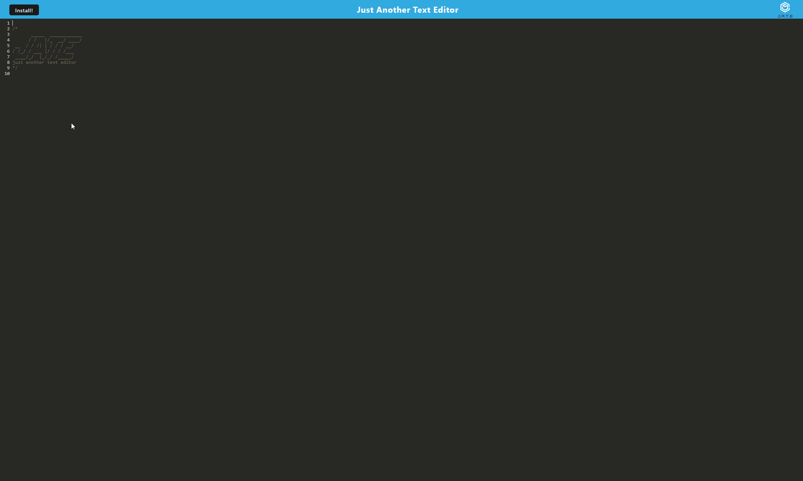

# JATE

---

## Technology Used 🖥️

| Technology Used         | Resource URL           | 
| ------------- |:-------------:| 
| JavaScript | [https://developer.mozilla.org/en-US/docs/Web/JavaScript](https://developer.mozilla.org/en-US/docs/Web/JavaScript)     |  
| Babel | [https://babeljs.io/](https://babeljs.io/) |
| Webpack | [https://webpack.js.org/](https://webpack.js.org/) |
| WebpackPWAManifest | [https://www.npmjs.com/package/webpack-pwa-manifest](https://www.npmjs.com/package/webpack-pwa-manifest) |
| Service Workers | [https://developer.mozilla.org/en-US/docs/Web/API/Service_Worker_API](https://developer.mozilla.org/en-US/docs/Web/API/Service_Worker_API) |
| IndexedDB | [https://developer.mozilla.org/en-US/docs/Web/API/IndexedDB_API](https://developer.mozilla.org/en-US/docs/Web/API/IndexedDB_API) | 
| node.js | [https://nodejs.org/en](https://nodejs.org/en)     |     
| Express.js | [https://expressjs.com/](https://expressjs.com/)     |     
| dotenv | [https://www.npmjs.com/package/dotenv](https://www.npmjs.com/package/dotenv)     |     
| HTML | [HTML](https://developer.mozilla.org/en-US/docs/Web/HTML)         |   
| CSS | [CSS](https://developer.mozilla.org/en-US/docs/Web/CSS)         |   
| Heroku | [Heroku](https://devcenter.heroku.com/articles/heroku-cli)     |
| Git | [https://git-scm.com/](https://git-scm.com/)     |   

---

## Description 📝

JATE (Just Another Text Editor) is a progressive web app that, quite literally, lets you just edit text on the application. There's no other purpose to it, lol.

JATE was built using primarily webpack and some associated functions, such as WebpackPWAManifest to name one, to allow the application to serve up and bundle all of this application's necessary frontend components. The app also used service workers to allow for caching for faster loading as well as offline usage. 
Since this application doesn't use databases such as MongoDB or MySQL, it stores information on the client's side using IndexedDB and local storage. Through IndexedDB, we can store and retrieve the text that the user writes without any extra overhead on the server side.

-----------------------

## Table of Contents 📋
* [Installation Instructions](#installation-instructions-📥)
* [Usage Information](#usage-information-✅)
* [Author Info](#author-info-👺)
* [Questions?](#questions-❓)
* [License](#license-🚩)

----------------------

## Installation Instructions 📥

To install the application, please follow the steps below:

1. Clone/download the contents of this repo down to your local machine
2. Open the terminal in the root directory of this application
3. Run `npm run install` to download all of the proper dependencies
4. Run `npm run start` or `npm run start:dev` to start the server and automatically build the client/dist folder

------------------------

## Usage Information ✅

To use the app, follow the steps below:

1. Make sure you have followed the instructions above on installing the application
2. Go to `http://localhost:3000` to view the application
3. Type anything you'd want
4. Alternatively, you can also visit this website: [https://daevidvo-jate.herokuapp.com/](https://daevidvo-jate.herokuapp.com/)

------------------------

## Author Info 👺

### ***daevidvo***
* [Github](https://www.github.com/daevidvo)
* [LinkedIn](https://www.linkedin.com/in/daevidvo)
* [Instagram](https://www.instagram.com/daevidvo)

--------------------------

## Questions ❓

Email me at: [daevidvo@gmail.com](mailto:daevidvo@gmail.com) or [visit my GitHub](https://www.github.com/daevidvo)

------------------------

## License 🚩

https://opensource.org/licenses/MIT

The MIT License (MIT)
=====================

Copyright © daevidvo

Permission is hereby granted, free of charge, to any person
obtaining a copy of this software and associated documentation
files (the “Software”), to deal in the Software without
restriction, including without limitation the rights to use,
copy, modify, merge, publish, distribute, sublicense, and/or sell
copies of the Software, and to permit persons to whom the
Software is furnished to do so, subject to the following
conditions:

The above copyright notice and this permission notice shall be
included in all copies or substantial portions of the Software.

THE SOFTWARE IS PROVIDED “AS IS”, WITHOUT WARRANTY OF ANY KIND,
EXPRESS OR IMPLIED, INCLUDING BUT NOT LIMITED TO THE WARRANTIES
OF MERCHANTABILITY, FITNESS FOR A PARTICULAR PURPOSE AND
NONINFRINGEMENT. IN NO EVENT SHALL THE AUTHORS OR COPYRIGHT
HOLDERS BE LIABLE FOR ANY CLAIM, DAMAGES OR OTHER LIABILITY,
WHETHER IN AN ACTION OF CONTRACT, TORT OR OTHERWISE, ARISING
FROM, OUT OF OR IN CONNECTION WITH THE SOFTWARE OR THE USE OR
OTHER DEALINGS IN THE SOFTWARE.
